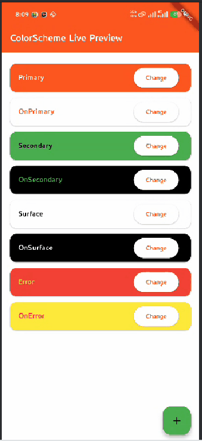

# Theme Color Change

### Appbar Theme


##### MaterialApp ()

```
theme: ThemeData(
        appBarTheme: AppBarTheme(
          backgroundColor: Colors.deepOrange,
          foregroundColor: Colors.white,
        ),
      ),
```


### Full App Color Scheme

```
colorScheme: ColorScheme(
  brightness: Brightness.light,
  primary: Colors.deepOrange,
  onPrimary: Colors.lightBlue,
  secondary: Colors.green,
  onSecondary: Colors.white12,
  error: Colors.red,
  onError: Colors.yellow,
  surface: Colors.white,
  onSurface: Colors.black
),
```

### ব্যাখ্যা:

- Brightness

        Brightness.light → পুরো অ্যাপের light theme (সাদা ব্যাকগ্রাউন্ডের মত) ব্যবহার হবে।
        Brightness.dark হলে dark theme হবে।

- Primary

        অ্যাপের মূল রঙ।
        AppBar, FloatingActionButton, active elements, checkbox ইত্যাদির রঙ।
        উদাহরণ: Colors.deepOrange হলে AppBar, FAB ইত্যাদি deep orange হবে।

- onPrimary
  
        primary রঙের উপর লেখা বা icon-এর রঙ।
        উদাহরণ: AppBar background যদি deepOrange হয়, title text lightBlue হবে।
  

- Secondary

        অ্যাপের সেকেন্ডারি রঙ।
        ট্যাব, chips, FAB (যদি secondary ব্যবহার করা হয়) ইত্যাদিতে ব্যবহার।

- onSecondary

        secondary রঙের উপরের লেখা বা icon-এর রঙ।

- Error

        Error messages, error buttons ইত্যাদির জন্য।

- onError

        Error-colored element-এর উপর লেখা বা icon-এর রঙ।

- Surface

        Cards, sheets, dialogs এর ব্যাকগ্রাউন্ড রঙ।

- onSurface

        Surface-colored element এর উপর লেখা বা icon-এর রঙ।

#### 💡 মনে রাখো:

- primary + onPrimary = প্রধান UI element + তার লেখা।
- secondary + onSecondary = সেকেন্ডারি element + লেখা।
- surface + onSurface = Card, Dialog ইত্যাদি + লেখা।
- error + onError = Error UI + লেখা।

##### Demo




###### © All right reserved by Faysal


